# Dokumentation

## 1. Einleitung

Der Zweck dieses Projekts ist, die Anwendungsmöglichkeiten von JEPA-Modellen (vor allem [V-JEPA](https://ai.meta.com/research/vjepa/)) zur Anomalieerkennung in Alltagsaktivitäten zu evaluieren. Dazu gibt es in diesem
Repo verschiedene Experimente, die ich im Laufe des Semesters ausprobiert habe.

Das Projekt ist in 2 Abschnitte gegliedert: (direkte) Anomaliedetektion und Schüttvolumenschätzung.
In Abschnitt 1 habe ich mich damit auseinandergesetzt, wie gut die embeddings von JEPA schon ein Signal für "Anomalie"
enthalten. Es war auch für mich selber eine Möglichkeit, über die verschiedenen Output-formate und Definitionen von
"Anomalie" zu lernen.

Danach ging es um Schüttvolumenschätzung, modelliert nach dem eXprt-Datensatz. Das Modell bekommt Videos, die nicht
hochauflösend und von weit entfernt aufgenommen wurden. In den Videos wird eine Flüssigkeit in einen undurchsichtigen Behälter geschüttet.
Wie gut kann das Modell/JEPA erkennen, wie viel Flüssigkeit geschüttet wurde? Hier geht es nicht direkt um
Anomalieerkennung. Die Motivation ist, dass man Anomalieerkennung oft in kleinere Schritte aufteilen
muss, um gute Ergebnisse zu erzielen. Das Beispiel hier ist, zu erkennen ob in einem fixen Prozess
die richtige Menge an Flüssigkeit in einen Behälter geschüttet wurde.

Die Ergebnisse sind eine Mischung aus Literaturrecherche und vergleichbaren Benchmarks auf einer Vielzahl von Datensätzen.

Die Literaturrecherche klärt, welche Ansätze es für eine Aufgabe schon gibt und was als
fairer Vergleich taugt.

Qualitativ ergibt sich folgendes Bild. Die Embeddings enthalten ein Signal für Fehler in
Handlungsabläufen, aber nur, wenn man dem Modell Fehlerbeispiele zeigt. Anomalien ohne solche
Beispiele zu erkennen, gelingt kaum. Beim Schütten erkennt V-JEPA zuverlässig die Flussrate, aus der sich das Gesamtvolumen
ableiten lässt. Aufgrund der geringen Größe und Varianz des
Datensatzes brechen die Ergebnisse in ungesehenen Testumgebungen
aber schnell ein.
Die Zahlen dazu stehen in [Kapitel 3](#3-vorgehen).

Die Arbeit stützt sich vor allem auf drei Quellen:
[V-JEPA 2](https://ai.meta.com/blog/v-jepa-2-world-model-benchmarks/)
([Assran et al. 2025](https://arxiv.org/abs/2506.09985)) liefert das Modell, die Checkpoints und
den Probe-Head. [EgoPER](https://www.khoury.northeastern.edu/home/eelhami/egoper.htm)
([Lee et al. 2024](https://openaccess.thecvf.com/content/CVPR2024/html/Lee_Error_Detection_in_Egocentric_Procedural_Task_Videos_CVPR_2024_paper.html))
ist der Datensatz der ersten Phase.
[The Sound of Water](https://bpiyush.github.io/pouring-water-website/)
([Bagad et al. 2025](https://arxiv.org/abs/2411.11222)) ist die nächstverwandte Arbeit zum
Schütten.
Sie schätzt Füllstände aus dem Ton und dient hier als Vergleich. Alle weiteren Quellen stehen am
Ende des Dokuments.

Einen kurzen Überblick über das Repo gibt das [README](README.md). [Kapitel 2](#2-literatur) fasst die Literaturrecherche
zusammen. [Kapitel 3](#3-vorgehen) geht die Ordner in zeitlicher Reihenfolge durch und beschreibt jeweils zuerst
den Code, dann wie sich die Experimente entwickelt haben, und zuletzt die Ergebnisse. [Kapitel 4](#4-hinweise)
enthält Hinweise zu KI-generiertem Code und zur Reproduzierbarkeit.

## 2. Literatur

### 2.1 JEPA und V-JEPA 2

[V-JEPA](https://arxiv.org/abs/2404.08471) (Bardes et al. 2024) lernt aus Videos ohne Labels,
indem es die Repräsentation maskierter Videoteile vorhersagt statt deren Pixel. Das Modell soll so
erfassen, was in einer Szene passiert, ohne jedes Bilddetail zu rekonstruieren. Deshalb liegt die
Frage nahe, wie viel Information über Handlungen in seinen Embeddings steckt.

V-JEPA 2 skaliert das Verfahren und veröffentlicht vortrainierte Encoder, darunter den hier
verwendeten ViT-L. Evaluiert wird mit Encoder und einem attentive-Probe-Head (siehe paper).

[DINOv3](https://arxiv.org/abs/2508.10104) (Siméoni et al. 2025) ist ein selbstüberwachtes
Bildmodell, das jedes Frame einzeln verarbeitet. Es dient als Vergleich dafür, wie viel das
Videoverständnis von V-JEPA tatsächlich bringt.

### 2.2 Fehler- und Anomalieerkennung in Handlungsvideos

EgoPER ist ein Datensatz für Fehler in Handlungsabläufen: egozentrische Videos von fünf
Kochaufgaben, darunter Kaffee und Tee. Für jedes Video sind die Arbeitsschritte annotiert und
Fehler zeitlich markiert. Damit gehört er zu den wenigen Datensätzen, auf denen sich messen lässt,
*wann* in einem Video ein Fehler passiert, nicht nur *ob*.

Die mitgelieferte Methode EgoPED zerlegt das Video in Arbeitsschritte und lernt für jeden Schritt
Prototypen, und zwar ausschließlich aus fehlerfreien Videos. Ein Abschnitt, der zu keinem
Prototyp passt, gilt als Fehler.

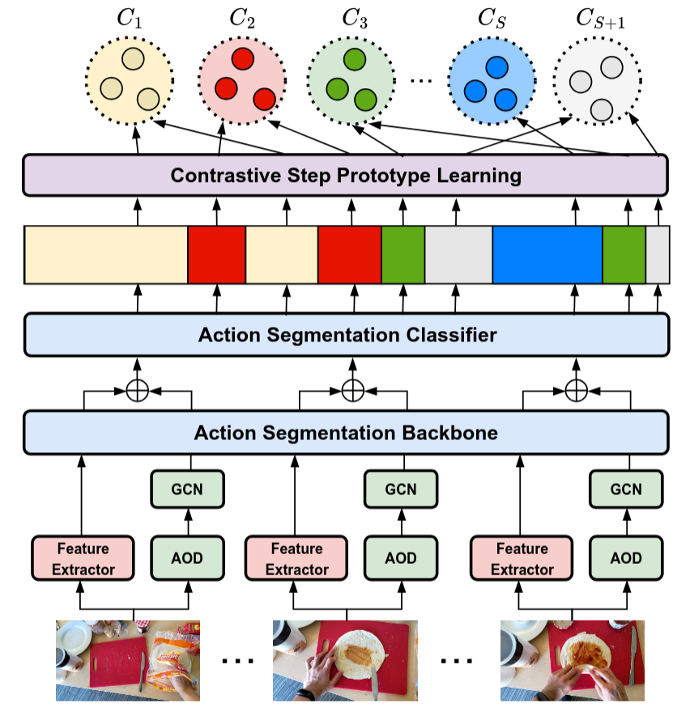
*EgoPED: Aus fehlerfreien Videos werden Prototypen pro Schritt gelernt. Abweichungen gelten als
Fehler.*

Video-Sprachmodelle im Stil von [LLaVA](https://arxiv.org/abs/2304.08485) (Liu et al. 2023)
verbinden einen Bild- oder Video-Encoder über eine kleine Projektionsschicht mit einem LLM. Die Features des Encoders werden wie Wörter in dessen Eingabe eingefügt, und das
Sprachmodell beantwortet dann Fragen zum Bild oder Video. V-JEPA 2 beschreibt in einem Anhang
genau diesen Aufbau mit dem eigenen Encoder. Diesen habe ich zum Einstieg nachgebaut ([Abschnitt 3.1](#31-einarbeitung-v-jepa-2--llm-video_qa)).

[SlowFast-LLaVA-1.5](https://arxiv.org/abs/2503.18943) (Xu et al. 2025) überträgt das auf lange
Videos: Ein langsamer Pfad sieht wenige Frames mit vielen Tokens, ein schneller Pfad viele Frames
mit wenigen Tokens. So bleibt sowohl das *Wo* als auch das *Wann* erhalten, ohne das Sprachmodell
mit Tokens zu überladen. Diese Aufteilung habe ich später als Pooling für V-JEPA-Features
übernommen ([Abschnitt 3.3](#33-fehlererkennung-auf-egoper-egoper_probe)).

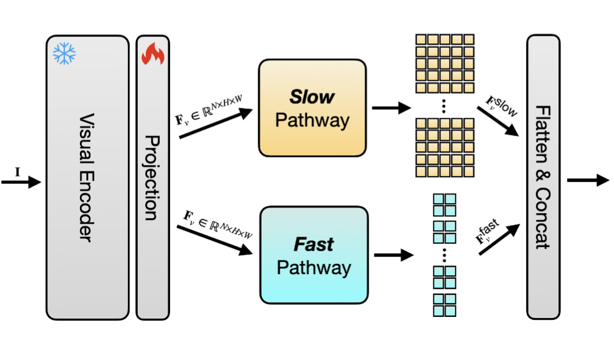
*SlowFast-LLaVA: ein langsamer Pfad mit vielen Tokens pro Frame und ein schneller Pfad mit
wenigen Tokens über viele Frames.*

### 2.3 Schüttmengen und Flüssigkeiten

The Sound of Water schätzt aus dem Geräusch beim Eingießen Behältergröße, Füllstand und
Flussrate. Die zugrunde liegende Physik setzt voraus, dass gleichmäßig geschüttet wird und der
Behälter am Ende voll ist. Das trifft auf unsere Aufnahmen nicht zu, deshalb nutze ich nur die
Audio-Features des Modells als Vergleich.

[Wilson et al. (2019)](https://doi.org/10.1109/IROS40897.2019.8968118) schätzen das geschüttete
Gewicht aus Ton und Bild, allerdings als Klassifikation in groben Stufen. Auf ihren Daten schneidet
The Sound of Water besser ab.

[Schenck & Fox (2017)](https://arxiv.org/abs/1610.02610) steuern einen Roboter beim Eingießen
anhand von Flüssigkeitsmasken im Bild. Ihr Datensatz UWLPD enthält echte Videos, aber keine
Mengenangaben.

[SimLiquid](https://doi.org/10.22541/au.173321942.24618438/v1) (Huang et al. 2024) erzeugt
synthetische Bilder von Flüssigkeiten mit bekanntem Volumen. Es war als Quelle für Vortraining
eingeplant, wurde aber nicht genutzt.

[Grounding DINO](https://arxiv.org/abs/2303.05499) (Liu et al. 2023) findet Objekte anhand einer
Textbeschreibung, ohne dafür trainiert zu werden. Nützlich für region-of-interest cropping ([Abschnitt 3.6](#36-flussrate-und-volumen-aus-video-pouringpour_probe)).

Keine dieser Arbeiten deckt meine Fragestellung genau ab,
weshalb es noch einen selbst aufgenommenen Datensatz gibt ([Abschnitt 3.5](#35-eigener-schütt-datensatz-pouringclip_split)).

## 3. Vorgehen

### 3.1 Einarbeitung: V-JEPA 2 + LLM (`video_qa/`)

#### Code
[`video_qa/`](video_qa/) baut den LLaVA-artigen Aufbau aus Appendix E von V-JEPA 2 nach: Der 
Encoder wird über einen Projektor an Qwen2.5-7B angeschlossen, das in 4 Bit mit LoRA
trainiert wird. Die drei Trainingsstufen des Papers (Bildbeschreibungen, Bild-QA, Video-QA) sind
jeweils eine Config in [`configs/`](video_qa/configs/). Wichtig ist vor allem [`model.py::build_encoder`](video_qa/model.py): Er
lädt den V-JEPA-2-Encoder und wird von allen späteren Ordnern verwendet.

#### Entwicklung
Der Nachbau war mein Einstieg, um den Encoder und seinen Speicherbedarf kennenzulernen. Damit er
auf eine GPU mit 16 GB passt, sind Auflösung, Frame-Zahl und Datensätze gegenüber dem Paper
verkleinert. Das ganze habe ich relativ bald eingestellt,
da sich das beschränkte memory-budget schnell bemerkbar gemacht
habe und andere Ansätze vielversprechender schienen.

#### Ergebnisse
Funktionierende training loops und erste Experimente, aber
nichts handfestes.

### 3.2 Zero-Shot-Baselines auf EgoPER (`egoper_vqa/`)

#### Code
[`egoper.py`](egoper_vqa/egoper.py) lädt die EgoPER-Annotationen und liefert pro Video die Ground Truth (Arbeitsschritte,
Fehler und deren Zeitpunkte). [`vqa.py`](egoper_vqa/vqa.py) stellt Qwen2.5-VL frei formulierte Fragen zu einem Video,
wahlweise mit dem trainingsfreien SlowFast-Schema. Das Notebook [`inference.ipynb`](egoper_vqa/inference.ipynb) führt das einmal von Anfang
bis Ende vor. Die [`ek100_tea*.py`](egoper_vqa/)-Skripte testen den EK100-Head von V-JEPA 2 ohne weiteres
Training auf den Tee-Videos und visualisieren das Ergebnis.

#### Entwicklung
Das beste auf meiner GPU laufende open-weight Modell war Qwen2.5-VL 3B.
Bei 10–12 Minuten langen Videos
sieht das Modell nur etwa alle 20 Sekunden ein Bild, kurze Fehler fallen also durchs Raster.
Als zweiten Vergleich habe ich V-JEPA 2 mit dem mitgelieferten EK100-Head direkt auf die
Tee-Videos angewendet. Er sagt für jeden Abschnitt die wahrscheinlichste Aktion vorher.

#### Ergebnisse
Qwen2.5-VL 3B liefert kaum nutzbare Ergebnisse.
Die Modelle erkennen grob, welcher
Arbeitsschritt gerade passiert, aber nicht, ob dabei ein Fehler gemacht wird.

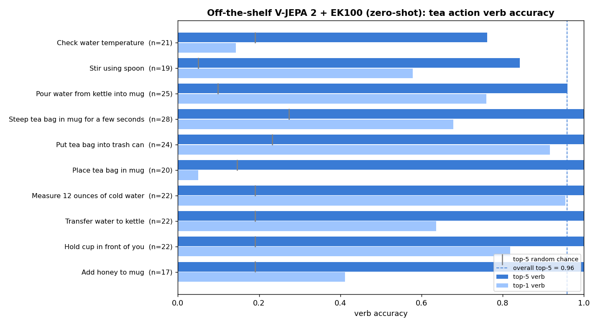
*Der EK100-Head von V-JEPA 2 ohne Training auf den EgoPER-Tee-Videos: Trefferquote des
richtigen Verbs pro Arbeitsschritt (hell: bester Treffer, dunkel: unter den besten fünf).*

### 3.3 Fehlererkennung auf EgoPER (`egoper_probe/`)

#### Code
[`extract.py`](egoper_probe/extract.py) berechnet V-JEPA-2-Features über kurze Fenster jedes Videos, einmal als Mittelwert
und einmal nach dem SlowFast-Prinzip aus [Abschnitt 2.2](#22-fehler--und-anomalieerkennung-in-handlungsvideos).
[`probe.py`](egoper_probe/probe.py) trainiert darauf eine lineare Probe und testet sie auf ungesehenen Videos.

#### Entwicklung
Ziel war es herauszufinden, wie gut sich nur anhand von V-JEPA-Features Anomalien erkennen lassen.
Dazu habe ich exemplarisch die Kaffee-Videos vom EgoPER-Datensatz verwendet.
Getestet habe ich zwei Fälle: mit
Fehlerbeispielen im Training und, wie bei EgoPED, nur mit fehlerfreien Videos.

#### Ergebnisse
Mit Fehlerbeispielen trennt die Probe Fehler deutlich besser als Zufall. Nur mit fehlerfreien Videos
gelingt das kaum.

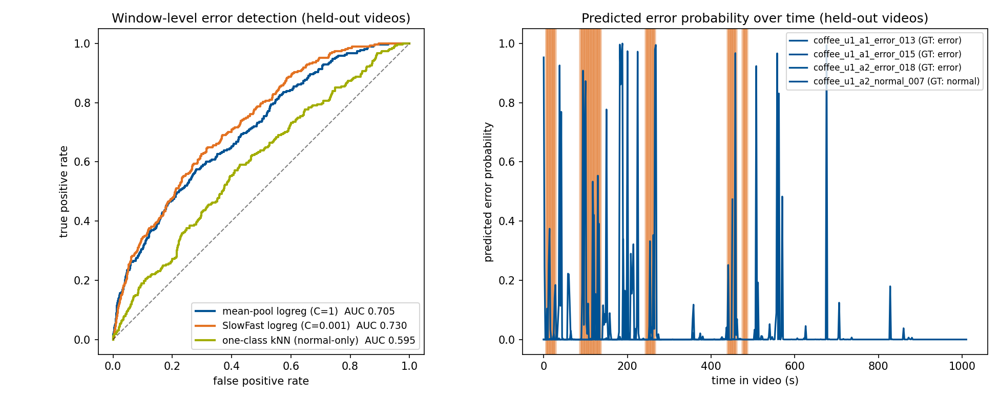
*Links: ROC-Kurven auf ungesehenen Videos. Die grüne Kurve ist der Fall ohne Fehlerbeispiele. Rechts:
vorhergesagte Fehlerwahrscheinlichkeit innerhalb eines Videos. Orange markiert die echten Fehler.*

### 3.4 Anomalie- und Aktionserkennung auf eXprt (`exprt_probe/`)

#### Code
[`dataset.py`](exprt_probe/dataset.py) ordnet die Versuchsprotokolle den Aufnahmen zu. [`extract.py`](exprt_probe/extract.py) und [`pool.py`](exprt_probe/pool.py) berechnen
die V-JEPA-2-Features einmal vorab, sodass [`train.py`](exprt_probe/train.py) danach in Sekunden trainiert. [`head.py`](exprt_probe/head.py)
baut einen attentiven Probe-Head, der aus dem EK100-Head initialisiert wird. [`action_probe*.py`](exprt_probe/)
erkennt Arbeitsschritte statt Fehler.

#### Entwicklung
eXprt ist der Tee-Datensatz des Lehrstuhls: 40 Durchgänge, acht Varianten mit je fünf
Wiederholungen, davon nur eine fehlerfrei. Gefilmt wird aus fester Position von außen statt
egozentrisch, und Labels gibt es nur pro Video, nicht pro Zeitpunkt. Einzelne Clips zu
klassifizieren scheiterte daran. Die Probe lernte nur das Aussehen der jeweiligen Aufnahme auswendig.
Deshalb bin ich auf Vorhersagen pro Video und auf die Erkennung von Arbeitsschritten ausgewichen.

#### Ergebnisse
Welcher Fehler in einem Video gemacht wurde, erkennt die Probe deutlich besser als Zufall. Ob überhaupt
einer gemacht wurde, erkennt sie nur knapp. Arbeitsschritte erkennt eine Probe auf den V-JEPA-Features gut,
der EK100-Head ohne Training dagegen kaum. Die Features enthalten also Information über
Handlungen, aber der kleine Datensatz begrenzt jede Aussage über Anomalien.

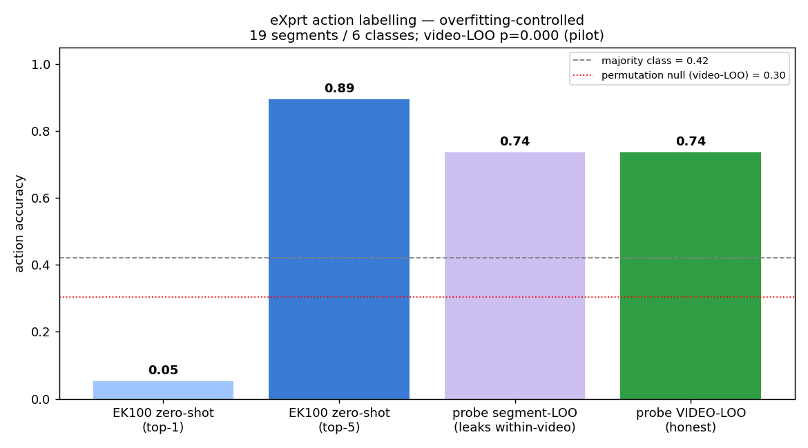
*Aktionserkennung auf eXprt: Der EK100-Head ohne Training trifft kaum (links), eine Probe auf den
V-JEPA-Features schon, auch wenn ganze Videos zurückgehalten werden (rechts).*

### 3.5 Eigener Schütt-Datensatz (`pouring/clip_split/`)

#### Code
Die Pipeline macht aus den Rohaufnahmen einzelne Clips mit Ground Truth, in Stufen mit einer
manuellen Kontrolle dazwischen: Waagenanzeige per OCR auslesen ([`lcd_ocr.py`](pouring/clip_split/lcd_ocr.py)), Schüttvorgänge
erkennen ([`detect_pours.py`](pouring/clip_split/detect_pours.py)), von Hand prüfen ([`annotate.py`](pouring/clip_split/annotate.py)) und schneiden ([`cut_clips.py`](pouring/clip_split/cut_clips.py)). Die
von Hand geprüften Annotationen liegen im Repo.

#### Entwicklung
Weil es keinen passenden Datensatz gab ([Abschnitt 2.3](#23-schüttmengen-und-flüssigkeiten)),
habe ich selbst einen erstellt. Input ist ein Video, in dem Wasser in einen Behälter geschüttet wird, Labels
sind das Gewicht der im Behälter gelandeten Flüssigkeit. Die Aufnahmen sind von drei GoPros, eine davon auf die Waage gerichtet, und
verschiedene Kombinationen aus Wasserkocher, Teekanne oder Flasche und Tasse oder Glas. Die automatische OCR-Erkennung des Gewichts reichte nicht für saubere
Labels, also habe ich ein kleines Annotationstool gevibecodet und alle Schüttvorgänge von Hand geprüft.

#### Ergebnisse
121 Clips aus zwei Perspektiven, jeweils mit dem Gewichtsverlauf. Der Datensatz
liegt auf dem TUM-NAS.

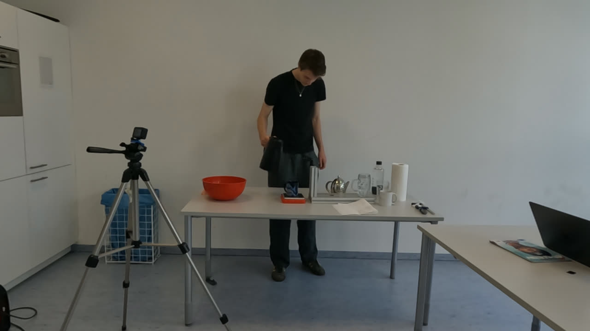
*Die Aufnahmesituation aus Sicht von CAM3: Das Gefäß nimmt nur einen kleinen Teil des Bildes ein.*

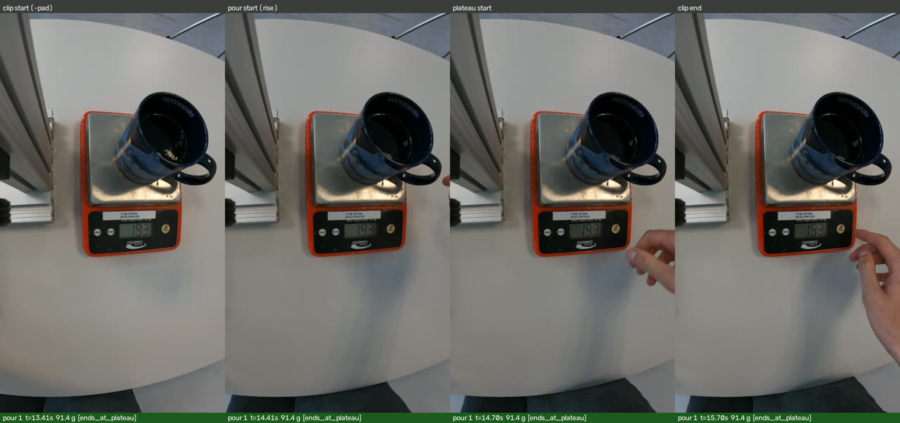
*CAM1 filmt die Waage. Aus ihrer Anzeige entsteht per OCR die Ground Truth. Die Bildfolge zeigt
die erkannten Grenzen eines Schüttvorgangs.*

### 3.6 Flussrate und Volumen aus Video (`pouring/pour_probe/`)

#### Code
Jeder Clip wird in Fenster von einer Sekunde zerlegt. Für jedes Fenster gibt es zwei Zielgrößen:
die Flussrate (wie viel gerade geschüttet wird) und das Volumen (wie viel bisher geschüttet
wurde). [`clips_train_attn.py`](pouring/pour_probe/clips_train_attn.py) trainiert das Hauptmodell, einen attentiven Probe-Head, und
[`clips_train.py`](pouring/pour_probe/clips_train.py) ist eine schnelle lineare Variante. Daneben gibt es Skripte für Vergleichsmodelle,
für die Auswertung und für die Demo-Videos. Die vollständige Übersicht steht in
[`pour_probe/README.md`](pouring/pour_probe/README.md).

#### Entwicklung
Angefangen habe ich mit einer linearen Probe, später kam der attentive Probe-Head dazu. Früh fiel
auf, dass die Waage das Wasser erst etwa 0,7 Sekunden nach dem sichtbaren Strahl registriert.
Diese Verzögerung gleicht das Training aus. Um zu zeigen, dass V-JEPA wirklich etwas im Bild
erkennt, habe ich das Modell mit einfachen Vergleichsmethoden verglichen, von der reinen
verstrichenen Zeit über klassische Video-CNNs bis zum Audio-Modell aus The Sound of Water. Danach
habe ich die Robustheit getestet: andere Kameraperspektive, Zuschnitt auf die Gefäße, höhere
Auflösung, ein anderes Backbone (DINOv3) und Stabilität bei minimal verschobenen Fenstern.
Zuletzt kamen Videos außerhalb des Labors dazu. Unterwegs habe ich mehrere eigene Fehler in der
Auswertung gefunden und korrigiert (siehe [Abschnitt 4.1](#41-ki-generierter-code)).

#### Ergebnisse
Die Flussrate erkennt V-JEPA gut (R² 0,81, mittlerer Fehler 8,5 g/s) und deutlich besser als
die Vergleichsmodelle. Über die Zeit aufsummiert ergibt das die Menge pro Schüttvorgang auf im
Mittel 26 g genau, bei typischen Mengen um 140 g. Das Volumen zu einem Zeitpunkt lässt sich
dagegen fast genauso gut allein aus der verstrichenen Zeit schätzen. V-JEPA trägt hier wenig bei.

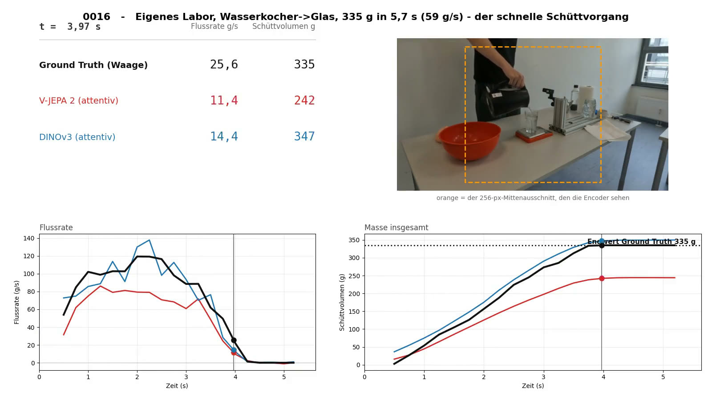
*Standbild aus einem Demo-Video (ungesehener Clip): Flussrate und geschüttete Masse von Waage
(schwarz), V-JEPA 2 (rot) und DINOv3 (blau). Der Verlauf stimmt, aber die Gesamtmenge unterschätzt
V-JEPA bei diesem schnellen Schüttvorgang.*

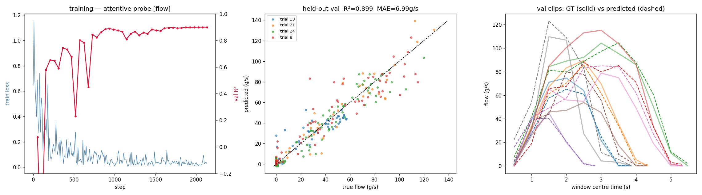
*Attentive Probe für die Flussrate (CAM2, ein Fold): Trainingsverlauf (links), Vorhersage gegen
Wahrheit auf ungesehenen Durchgängen (Mitte) und Flusskurven einzelner Clips, durchgezogen die
Waage, gestrichelt das Modell (rechts).*

Den Encoder teilweise mitzutrainieren bringt nichts, DINOv3 ist etwas schlechter, und die
Vorhersagen sind stabil. Für eine neue Kameraperspektive hilft es, das Bild auf die Gefäße
zuzuschneiden.

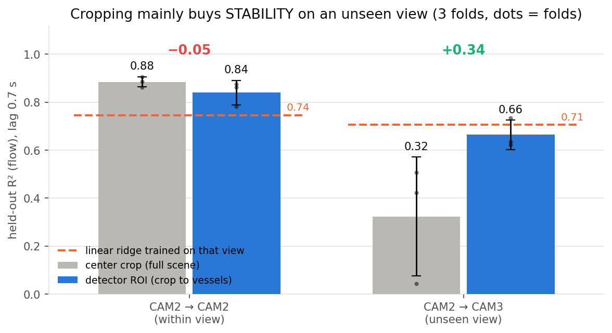
*Zuschnitt auf die Gefäße: In der eigenen Perspektive kostet er wenig, auf einer ungesehenen
Kamera macht er die Vorhersage deutlich besser und vor allem stabiler (3 Folds, Punkte = Folds).*

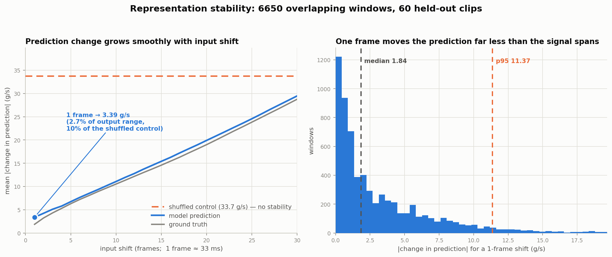
*Verschiebt man das Eingabefenster um einzelne Frames, ändert sich die Vorhersage etwa so
schnell wie die Wahrheit selbst (links) und weit weniger als bei zufälliger Zuordnung
(gestrichelt).*

In Videos aus anderen Datensätzen ist die Performance eher schwach. Das Modell gibt immer eine Flussrate über Null aus, auch wenn gar keine Flüssigkeiten im Video zu sehen sind. Langsames Schütten überschätzt es um
ein Vielfaches.

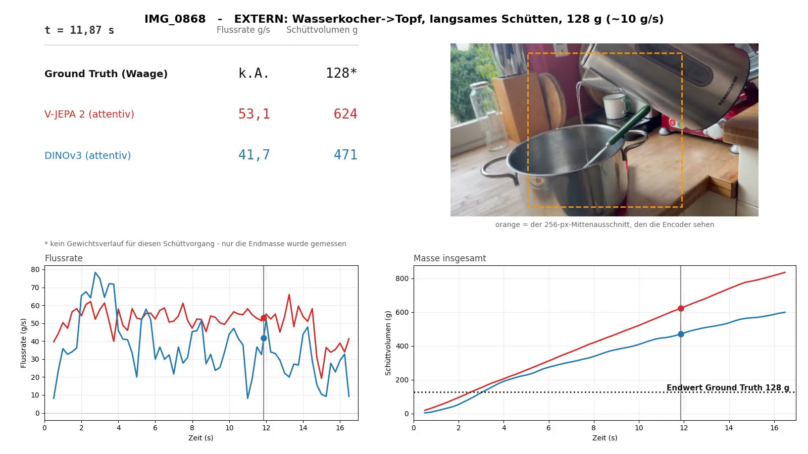
*Externes Video, langsam geschüttet (128 g): Beide Modelle sagen durchgehend starken Fluss vorher
und landen bei einem Vielfachen der echten Menge.*

## 4. Hinweise

### 4.1 KI-generierter Code
Ein Großteil des Codes und Teile der Dokumentation sind mit KI-Unterstützung (Claude Opus 5, GLM 5.2) entstanden. Damit das
trotzdem verlässlich bleibt, habe ich in kleinen Schritten gearbeitet: erst ein Pilot, zu jedem
Schritt eine Kontrollabbildung, und vor jedem langen Lauf eine bewusste Freigabe. Jedes Ergebnis
habe ich außerdem gegen einfache Vergleichsmethoden geprüft. Der Code ist im Detail
teilweise ausführlicher als nötig. Die lesbare Ebene sind die Ordnerstruktur, die READMEs und
dieses Dokument.

### 4.2 Reproduzierbarkeit
Die Umgebung wird mit `uv sync` eingerichtet, und die V-JEPA-2-Checkpoints kommen aus dem offiziellen
Release. Alle Trainingsläufe und Metriken stehen in [`mlflow.db`](mlflow.db) im Repo. EgoPER und Sound of Water
sind öffentlich, eXprt liegt am Lehrstuhl und die eigenen Clips auf dem TUM-NAS. Eine
Einschränkung: [`run_ocr.py`](pouring/clip_split/run_ocr.py) braucht das private Submodul `OCR_Scale_REader`.

## Quellen

- M. Assran, A. Bardes, D. Fan, Q. Garrido et al. *V-JEPA 2: Self-Supervised Video Models Enable
  Understanding, Prediction and Planning.* [arXiv:2506.09985](https://arxiv.org/abs/2506.09985), 2025.
- A. Bardes et al. *Revisiting Feature Prediction for Learning Visual Representations from
  Video.* [arXiv:2404.08471](https://arxiv.org/abs/2404.08471), 2024.
- S.-P. Lee, Z. Lu, Z. Zhang, M. Hoai, E. Elhamifar. *Error Detection in Egocentric Procedural
  Task Videos.* [CVPR 2024](https://openaccess.thecvf.com/content/CVPR2024/html/Lee_Error_Detection_in_Egocentric_Procedural_Task_Videos_CVPR_2024_paper.html), S. 18655–18666.
- D. Damen, H. Doughty, G. M. Farinella, A. Furnari et al. *Rescaling Egocentric Vision.*
  International Journal of Computer Vision 130(1), S. 33–55, 2022,
  [arXiv:2006.13256](https://arxiv.org/abs/2006.13256).
- H. Liu, C. Li, Q. Wu, Y. J. Lee. *Visual Instruction Tuning.* NeurIPS 2023,
  [arXiv:2304.08485](https://arxiv.org/abs/2304.08485).
- M. Xu, M. Gao, S. Li, J. Lu et al. *SlowFast-LLaVA-1.5: A Family of Token-Efficient Video Large
  Language Models for Long-Form Video Understanding.* [arXiv:2503.18943](https://arxiv.org/abs/2503.18943), 2025.
- S. Bai, K. Chen, X. Liu, J. Wang et al. *Qwen2.5-VL Technical Report.* [arXiv:2502.13923](https://arxiv.org/abs/2502.13923), 2025.
- P. Bagad, M. Tapaswi, C. G. M. Snoek, A. Zisserman. *The Sound of Water: Inferring Physical
  Properties from Pouring Liquids.* ICASSP 2025, [arXiv:2411.11222](https://arxiv.org/abs/2411.11222).
- J. Wilson, A. Sterling, M. C. Lin. *Analyzing Liquid Pouring Sequences via Audio-Visual Neural
  Networks.* IROS 2019, [DOI 10.1109/IROS40897.2019.8968118](https://doi.org/10.1109/IROS40897.2019.8968118).
- C. Schenck, D. Fox. *Visual Closed-Loop Control for Pouring Liquids.* ICRA 2017,
  [arXiv:1610.02610](https://arxiv.org/abs/1610.02610) (UWLPD).
- O. Siméoni et al. *DINOv3.* [arXiv:2508.10104](https://arxiv.org/abs/2508.10104), 2025.
- S. Liu, Z. Zeng, T. Ren, F. Li, H. Zhang et al. *Grounding DINO: Marrying DINO with Grounded
  Pre-Training for Open-Set Object Detection.* [arXiv:2303.05499](https://arxiv.org/abs/2303.05499), 2023.
- Y. Huang, J. Zhang, R. Yu, S. Li, W. Ding. *SimLiquid: A Simulation-Based Liquid Perception
  Pipeline for Robot Liquid Manipulation.* Authorea Preprint, 2024,
  [DOI 10.22541/au.173321942.24618438/v1](https://doi.org/10.22541/au.173321942.24618438/v1).
