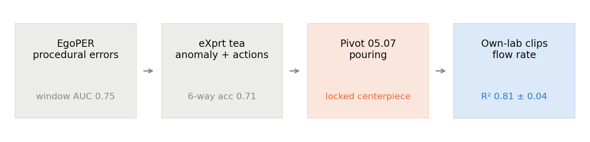

# Where the project went

- Constant across all four stages: **freeze V-JEPA 2 ViT-L, cache features, train a light head, hold out groups**
- Anomaly detection hit a ceiling set by labels, not by the representation
- Pouring gives a *continuous, physically measured* target, so the representation can be tested properly

**Question this deck answers:** does a frozen video foundation model read a physical quantity off raw pixels?

---

# Two claims, one deck

### What is established

- Frozen V-JEPA 2 reads **instantaneous flow rate** at **R² 0.81 ± 0.04**, MAE ~7 g/s
- Beats every non-V-JEPA baseline we could build
- Holds across held-out trials, containers and both camera views

### What is not

- **Absolute volume** is clock-dominated, not a vision win
- Total poured mass saturates at ~23 g error, and that is a **data** limit
- Zero-shot to a genuinely unseen camera angle needs cropping

SOTA is not the bar. A working, honestly bounded result is.

