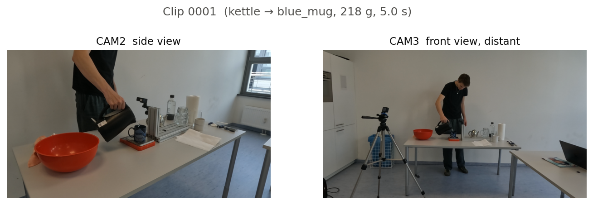
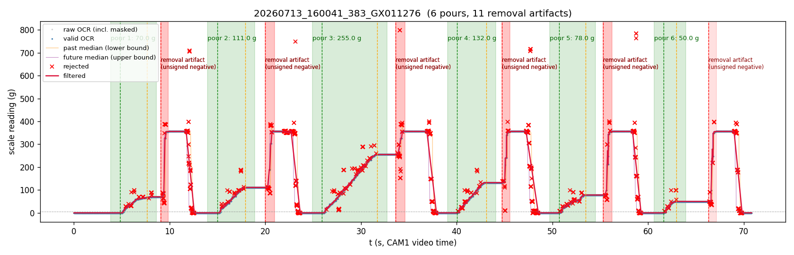
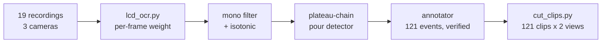
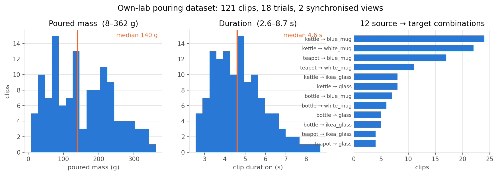
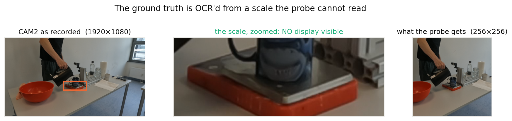

# The pivot: pouring flow and volume

### Why this target

- Continuous and dense in time, one label per 1 s window
- **Physically measured**, not annotated by opinion
- No prior work reports poured-mass or flow **regression** from third-person video
- Cheap to record more of

### Why it is hard

- Wide third-person shot, the stream is a few pixels wide
- Water is transparent, specular, fast
- Held-out containers and held-out scenes
- No public dataset with real gram-level ground truth

**So we recorded our own.** 2026-07-13, three synchronised GoPros, one pointed at a kitchen scale.

---

# Where this sits in the literature

| work | modality | output | relation to us |
|---|---|---|---|
| Wilson et al., **PSNN** (IROS 2019) | audio + visual | poured weight, 0.2 oz classes | closest prior task. Its data **is** a usable benchmark, see below |
| Bagad et al., **Sound of Water** (2024) | audio only | container height, flow rate, time to fill | audio SOTA, **no vision comparison**. We use it as a baseline |
| Schenck & Fox (IJRR 2018) | vision | per-pixel liquid mask | UWLPD lineage. Finds temporal information is essential |
| Lin et al. (ICCV 2023) | vision | liquid stream tracking | tracks the stream, not the mass |

**Gap:** no prior work regresses **flow rate** in physical units from a third-person camera. For flow there is no leaderboard to climb, so the deck is built out of baselines instead.

**But for mass there is one, and we should use it.** Sound of Water linear-probes on Wilson's data and reports a full baseline table. Their protocol is public: 136 sequences, 6 containers, per-container regressor. See the next slide.

---

# There is a benchmark we can actually enter

Sound of Water, Table 4. Mass estimation from pouring sound on **Wilson et al.'s** data, mean MAE in ounces:

| method | modality | MAE (oz) |
|---|---|---|
| SoundNet-8 | audio | 4.58 |
| k-NN | audio | 2.85 |
| TCN | audio | 2.45 |
| PSNN (Wilson et al.) | **audio + visual** | 1.35 |
| Sound of Water | audio | **1.20** |
| **frozen V-JEPA 2** | **video** | **?** |

### Why this is the right next experiment

- A published table with an established protocol, and **no video-foundation-model entry in it**
- Sound of Water beat PSNN's supervised fine-tuning with a **linear probe**, which is exactly our recipe
- They note "visual information is not used in any form", so the video slot is open
- Wilson's data has real weight annotations and is downloadable

Cost: extract frozen features over 136 sequences, fit 6 per-container ridges. Days, not weeks.

---

# Recording setup

**CAM1**, 119.88 fps 
Scale display, ground truth only, never fed to the model

**CAM2**, 29.97 fps 
Side view, the pour fills the frame

**CAM3**, 29.97 fps 
Front view, distant, whole body visible

18 trials &middot; 3 source vessels into 4 targets &middot; 12 combinations

---

# Ground truth: OCR of the scale, then physics

- Off-the-shelf OCR fails on a 170x80 px 7-segment display in a wide shot
- Own reader: static camera, per-pixel background model, per-cell correlation against synthetic 7-segment templates
- **95.2% valid readings**, 16 of 19 trials above 99.2%, 2 ms per frame

- **Monotonicity prior:** while pouring, true weight never decreases
- Rolling-median bounds reject dropouts and digit blends, then isotonic regression per pour
- Removing the cup drives the scale negative, the display drops the minus sign, producing a fake spike (red bands)

---

# From trials to clips: a gated pipeline

- Pour = maximal ascending chain between two settled plateaus
- "Cup barrier" rule ends a pour before the removal step
- Every clip weight was checked by hand in a local web UI
- One recording had no usable pours, so 18 trials survive

- Per-clip ground truth is 2 columns: `t_s, weight`
- Poured mass since clip start, baseline subtracted
- **Monotone by construction**, total equals the annotated mass

---

# The finished dataset

**121 clips**, 410 MB 
2 views each, plus GT curve

Flow **varies within and across pours**, which is exactly what makes the clock a weak baseline here

Uploaded to the TUM NAS under `Datenverarbeitung/pouring_clips/`

---

# The four datasets, and what each can actually tell us

| dataset | what it is | labels | how we used it | the catch |
|---|---|---|---|---|
| **Own-lab pouring**   *ours, 2026-07-13* | 121 clips, 18 trials, 12 container combos, 2 synced views at 1080p | **poured mass in grams**, OCR'd from a scale on a third camera. 8 to 362 g | train and evaluate the probe. **The deliverable** | one room, one person, one session |
| **Sound of Water**   *Bagad et al. 2024* | 1010 smartphone videos, 48 containers. 1000 clean, **780 used** | **no measured volume.** Container geometry plus fill time only | 1. their frozen **audio** model as a cross-modal baseline **on our clips**   2. our probe **on their videos** | see below |
| **UWLPD**   *Schenck & Fox* | 36 real pouring scenes, 640×480, per-frame binary liquid masks | **fill % only** (30 / 60 / 90), no mL | mask-derived proxy, smoke test of the pipeline | no volume labels. The mL trace is in their separate simulated set, requested, not in hand |
| **SimLiquid**   *BlenderProc renderer* | photoreal liquid-in-cup renders | **per-cup volume in mL**, clean by construction | renderer validated. **10k render not run** | sim-to-real gap untested |

**EK100** is not a pouring dataset. It supplies the optional warm start for the attentive head, and the ablation shows warm start ≈ random.

---

# Why Sound of Water cannot validate us

### What it is

- The strongest published model for **pouring from audio**, and the closest work to ours
- 1010 videos, 48 containers, ceramic / glass / paperboard / plastic / steel, hot and cold water
- Their target is **derived from their own audio model**, not measured. So our probe on their data measures *agreement with an audio-physics estimate*, not ground truth

### Why it is not a test of flow

- **988 of 1010 pours are labelled constant flow rate. Exactly one is labelled non-constant**
- Constant rate + fill to completion gives `T = V/Q`, so `V(t)/V = t/T` and **the rate cancels**. Normalised time *is* fill fraction, and a clock scores up to **0.98**
- Their flow ground truth is a **single scalar per video** (container volume ÷ fill time), never a trace

**This is a property of our repurposing, not a flaw in their paper.** Constant-within-pour is deliberate and load-bearing for them: their time-to-fill task is ill-defined without it, and they say so. Their randomisation is **between** pours. Our clock baseline exploits the **within**-pour axis. Both claims are correct, on different axes.

---

# Know the data before trusting the number

**What the probe may use**

- **RGB only**, 1.0 s window, 16 frames, 256 px
- Two synchronised views, CAM2 side and CAM3 distant
- Audio exists, used **only** by the cross-modal baseline

**Shortcuts we ruled out**

- **Read the scale?** No. The LCD faces the overhead OCR camera. At 256 px the scale is ~30×15 px
- **Memorise the scene?** No. Folds group **by trial**
- **Guess from the vessel?** No. A perfect container oracle adds **+0.001**

**Shortcuts that are real**

- **Look at the arm, not the stream.** The pooler learns "upper left". CAM2→CAM3 collapses to 0.04 on one fold
- **Duration leaks mass.** Clip length correlates **0.81** with total poured

What the data genuinely cannot say: fill level inside an opaque vessel, and how much the person *intended* to pour. Poured mass is set by pour duration, a free choice, not by the vessel.

