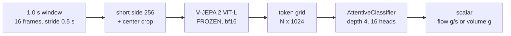

# Method: freeze everything except a small head

### Fixed choices

- Encoder never updated, in-loop so augmentation is pixel-space
- h-flip, random 256 crop from a cached 288 frame, ±0.1 s temporal jitter
- AdamW 1e-3, SmoothL1, ~9.7 GB VRAM

### Evaluation protocol

- **GroupKFold by trial**: clips of one trial share scene and container
- Same held-out trials for every baseline
- `flow` = Δweight over the window, `volume` = cumulative mass
- Everything tracked in mlflow

---

# The baselines we hold ourselves to

| baseline | what it tests | why it is fair |
|---|---|---|
| **predict mean** | the floor | R² is defined against it |
| **shuffled labels** | is the pipeline leaking? | same features, permuted targets |
| **raw time, linear** | can a clock do it? | window centre time only |
| **temporal profile** (norm-time poly4) | can the *average pour shape* do it? | needs pour boundaries, which the probe does not get |
| **motion energy** | is it just "something moved"? | frame-difference magnitude |
| **Kinetics video CNNs** (r2plus1d-18, s3d) | is it just *any* video model? | frozen + ridge, same pixels, same folds |
| **Sound of Water** audio model | is another modality better? | frozen + ridge, same folds, clip audio |

Appearance-based methods never see the clock. The temporal-profile prior is deliberately given an advantage the probe does not have.

---

# The objective is a design choice, and it has traps

### Three targets from one curve

| target | what it is | who wins |
|---|---|---|
| **flow** | derivative, g/s | **vision** |
| volume | cumulative g | the clock |
| total mass | one scalar | integrated flow |

- Flow is the only one with **within-pour structure a clock cannot fake**. 84% of its variance is within-pour, and the shape is a bell
- Volume is monotone, so a rising line already scores 0.78. Picking it would have hidden the result

### Traps we hit, in order

1. **Ground truth is late.** The scale lags the stream by **0.7 s**. Uncorrected, it costs ~0.09 R²
2. **The fix is not free.** At lag 0.7 on a 1.0 s window, frames and target overlap only **30%**. This is short-horizon prediction, not readout
3. **Baselines must use the same lag.** Scoring a lagged probe against an unlagged baseline flattered us by **+0.17** and once reversed a conclusion
4. **Some baselines are oracles.** Normalised time needs the pour's duration, unknowable mid-pour. Flag it or it wins unfairly
5. **R² against the global mean is a soft denominator.** Report **skill vs the best non-visual method** instead

Also fixed by design, not by tuning: SmoothL1 compresses extreme pours, but MSE made held-out totals worse (23 g to 31 g). The residual is aleatoric.

