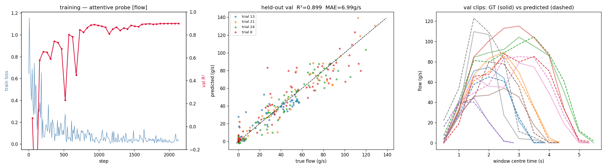
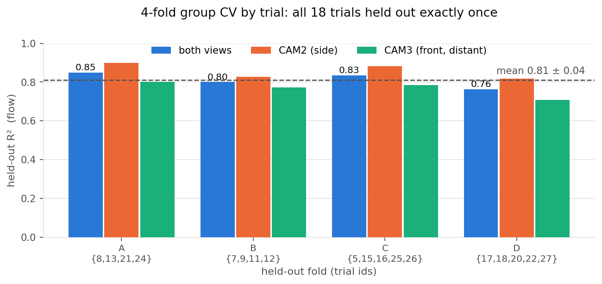
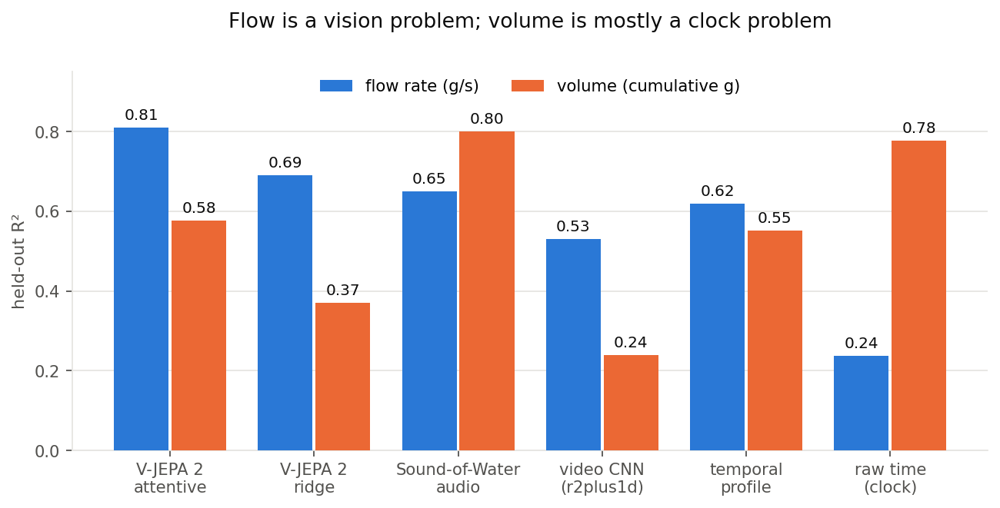
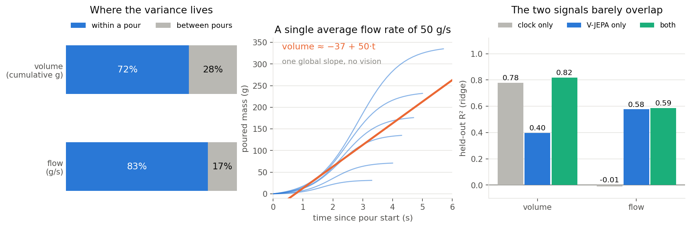
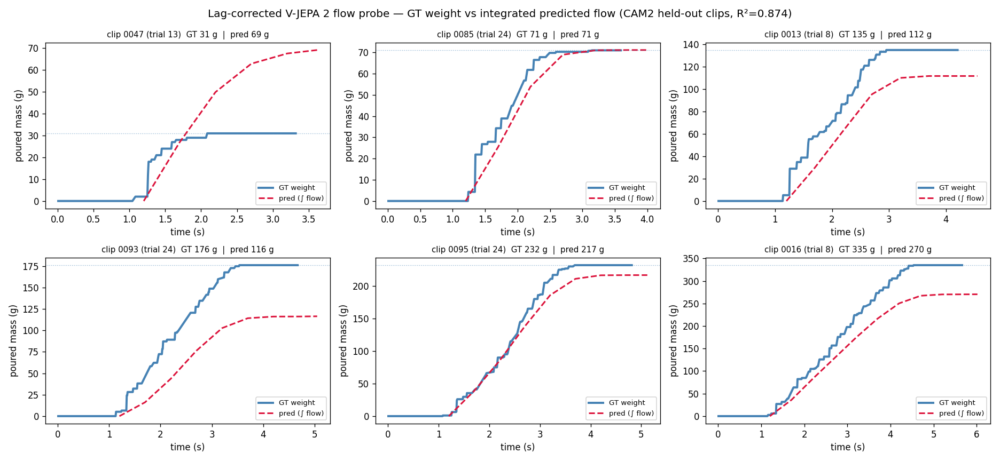
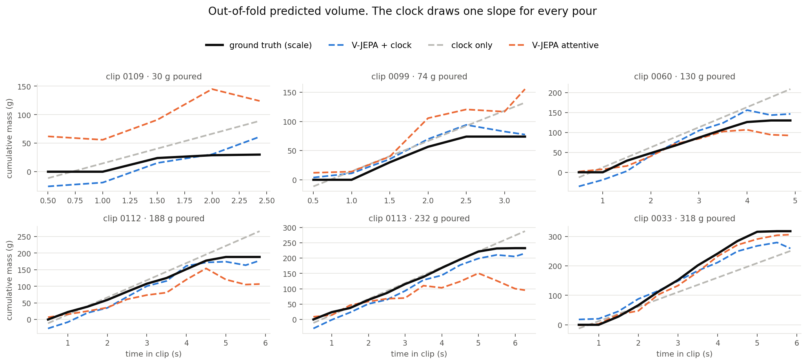

# Headline: flow rate

**+0.28 R²** over the best video CNN, the honest gap

**+0.19** over the boundary-cheating temporal prior

Shuffle collapses to **-0.32**, so the pipeline does not leak

---

# It tracks each individual pour, not the average one

- Right panel: solid = ground truth, dashed = prediction, held-out trials only
- Peak height *and* peak timing follow each clip, which the temporal-profile prior structurally cannot do
- Shown run is the CAM2-only probe (R² 0.899 on this split), the clearest illustration of the fit

---

# Error bars: 4-fold group CV over all 18 trials

The single-split 0.85 was the favourable end of the spread, not a fluke

CAM2 beats CAM3 by ~0.09 in **every** fold, the distant view is genuinely harder

Fold D is the hardest, no fold falls below 0.76

---

# Flow is a vision problem, volume is a clock problem

- Cumulative mass rises monotonically with elapsed time, so a linear clock alone reaches **0.78**
- The V-JEPA volume probe reaches only **0.58 ± 0.09** (4-fold), well *below* the clock

- Flow is the opposite: the clock gets only **0.24**, a straight line cannot draw a bell curve
- Next slide takes the volume number apart, because "the clock wins" is not the whole story

---

# Why does a clock beat a foundation model?

**Volume is mostly a within-pour question.** 72% of its variance is "how far into this pour are we", which elapsed time answers directly.

**The clock is one number.** It fits `volume ≈ −37 + 50·t`, i.e. it assumes every pour runs at the average 50 g/s. Nothing is learned about the scene.

**But the signals are complementary.** V-JEPA on top of the clock gives **0.82 > 0.78**, so vision does carry real fill information. It just cannot supply the clock term itself.

---

# "Are you just grading who can draw a line?"

- Fair objection: R² against the **global mean** rewards anything that rises with time
- Fix borrowed from our own Sound-of-Water protocol: remove each pour's mean, and score the trivial controls under the **same** metric
- Also give the time baseline the pour's **duration**, an oracle it would not have in deployment

- **Skill over the best non-visual method**, the fraction of its error removed:
- **Flow: +0.32**, over the oracle time profile
- **Volume: +0.19**, and only as V-JEPA *plus* clock. Alone it is far worse than the clock
- Verdicts unchanged, so the ranking is not a metric artefact

---

# Integrating predicted flow gives total poured mass

Shape and onset timing track ground truth on held-out clips

Total mass error **median 14 g, mean 22 g** over 30 clips (GT 31 to 335 g)

Failure mode: extremes compressed, big fast pours under-predicted

---

# In grams, not R²

**Per window** (4-fold OOF, both cams, attentive probe)

| method | MAE | medAE | P90 | bias | nMAE |
|---|---|---|---|---|---|
| **flow, V-JEPA** | **8.5 g/s** | 4.0 | 22.0 | −0.5 | **25%** |
| flow, clock | 24.2 g/s | 21.6 | 44.7 | +0.0 | 72% |
| volume, V-JEPA + clock | 28.5 g | 21.2 | 63.3 | −2.5 | 30% |
| volume, clock | 30.3 g | 17.5 | 71.2 | +0.3 | 32% |
| volume, V-JEPA | 39.9 g | 24.6 | 101.1 | −1.1 | 42% |

- R² 0.81 reads as "strong". **Wrong by 25% of the mean flow** reads as the truth
- On volume, vision beats the clock by **2 g**, not by a headline

**Per pour, total mass** (integrate predicted flow, n = 121, mean 141 g)

| method | MAE | medAE | ≤10 g | ≤25 g | ≤50 g |
|---|---|---|---|---|---|
| **V-JEPA attentive** | **23.2 g** | 14.5 | 32% | **74%** | **88%** |
| V-JEPA ridge | 32.6 g | 25.8 | 25% | 49% | 79% |
| predict mean | 48.0 g | 42.1 | 12% | 29% | 60% |
| clock | 63.2 g | 60.3 | 7% | 17% | 40% |

- **3 of 4 pours land within 25 g**, 7 of 8 within 50 g
- **The clock is worse than predicting the mean here.** Its 0.78 volume R² measured "early or late in the pour", not how much was poured
- Bland-Altman 95% limits: **−69 to +63 g**. One reading can still be far off

---

# What the predictions actually look like

**The clock is the same line in all six panels.** It has one slope, so it over-predicts a 30 g pour threefold and under-predicts a 318 g one. It even starts below zero.

**V-JEPA + clock bends and plateaus.** It follows the flattening when pouring stops, which is the part a straight line structurally cannot do.

**Direct volume regression is unstable on small pours.** On the 30 g clip it predicts 60 to 145 g. This is why the deliverable integrates flow instead.

Six clips chosen by total-mass quantile, not by eye. All curves are out-of-fold.

---

# Every model, every metric, every dataset

| model | input | **own-lab flow** R² | **own-lab volume** R² | **SoW volume** within-video |
|---|---|---|---|---|
| **V-JEPA 2 attentive probe** | video | **0.81 ± 0.04** | 0.58 ± 0.09 | 0.80 (S3) / 0.16 (S1) |
| V-JEPA 2 ridge on mean-pool | video | 0.69 | 0.37 ± 0.08  | n/a |
| V-JEPA 2 ridge **+ clock** | video + t | 0.72 | **0.82**  | n/a |
| Sound-of-Water audio model | audio | 0.65 | **0.80** | (their own corpus) |
| Kinetics video CNN (s3d / r2plus1d) | video | 0.54 / 0.53 | 0.24  | n/a |
| normalised-time profile ⚠ | **oracle** duration | 0.62 | 0.55 ± 0.05 | 0.80 to **0.98** |
| raw time, linear | elapsed t | 0.24 | 0.78  | n/a |
| motion energy | frame diff | 0.18  | n/a | n/a |
| predict mean | nothing | −0.01 | −0.00 | 0.00 |
| shuffled-label null | video | −0.32  | n/a | n/a |

**Protocol.** Own-lab = 4 folds grouped by trial, flow at lag 0.7, volume at lag 0. SoW = grouped by container, mean removed per video.

**⚠ oracle.** The normalised-time profile needs each clip's total duration, which you cannot know mid-pour. It is not deployable.

**Cross-view (flow, 3 folds):** center crop 0.32 ± 0.25, detector ROI 0.66 ± 0.06, ridge trained on the target view 0.71.

