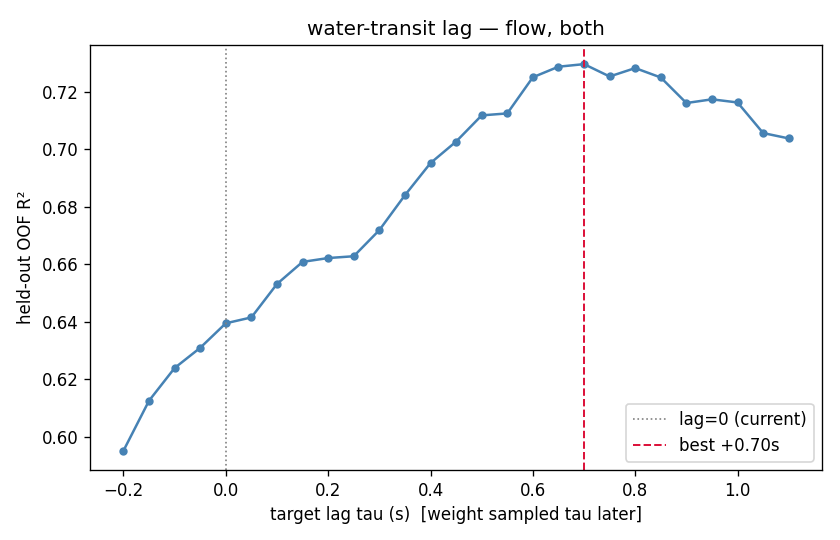
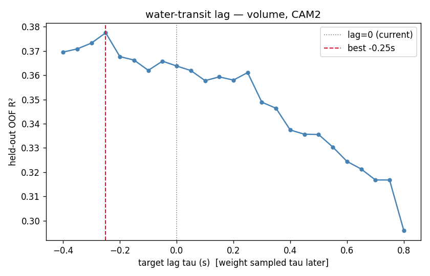
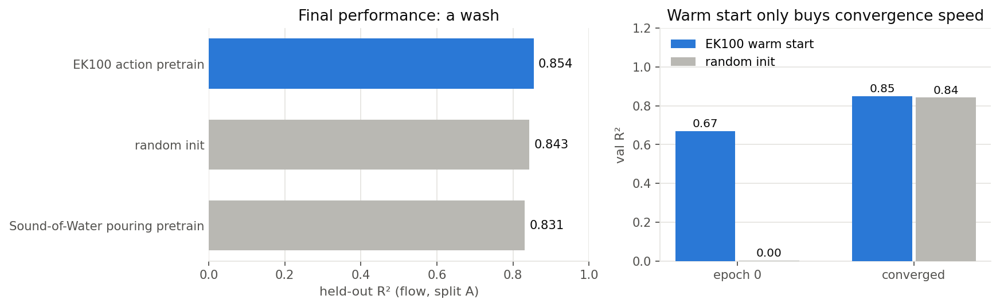
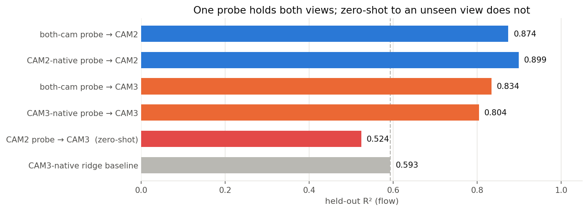
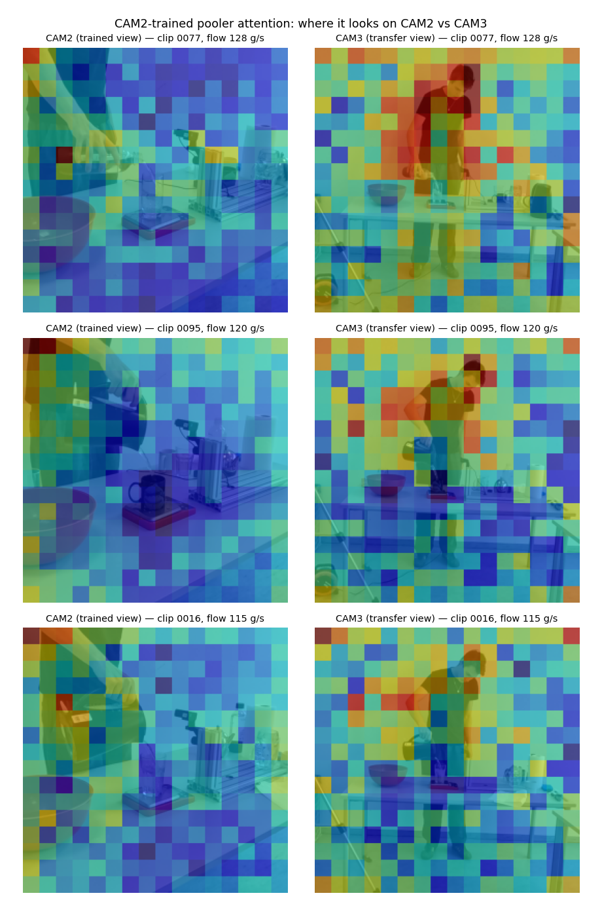
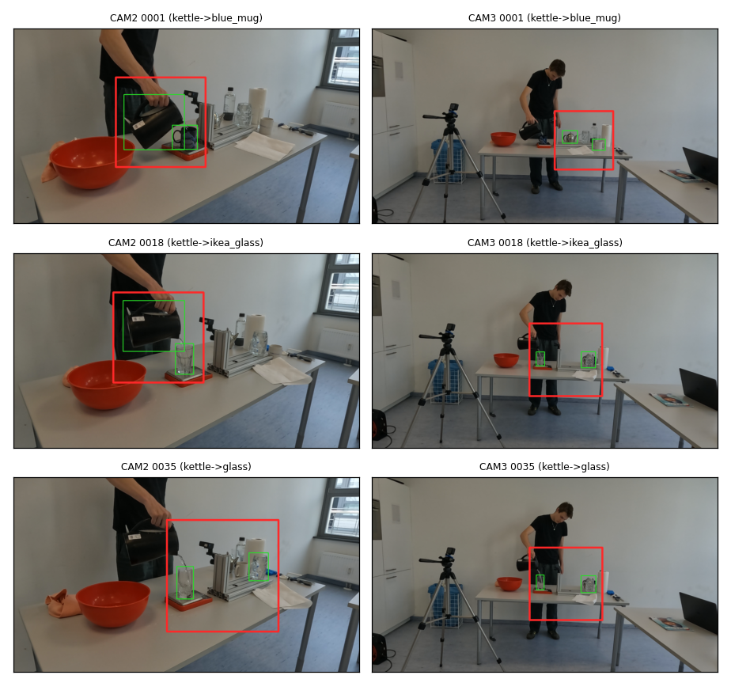
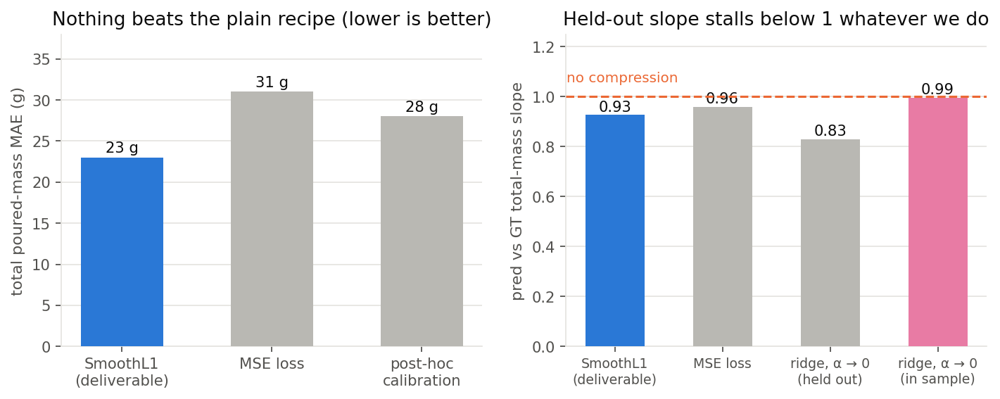
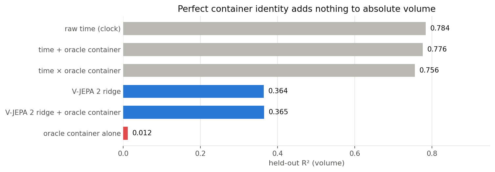

# Ablations: what we actually varied

| # | question | answer |
|---|---|---|
| 1 | Is the ground truth time-aligned with the video? | No. **0.7 s water-transit lag**, worth +0.09 R² |
| 2 | Does the pretrained head matter? | **No.** EK100 = random = Sound-of-Water pretrain |
| 3 | Does one probe hold both camera views? | **Yes**, and it lifts the weak view above its own native probe |
| 4 | Does it transfer to an unseen view? | **No.** Cropping to the vessels mostly fixes it |
| 5 | Can a better loss fix the total-mass tails? | **No.** Loss, calibration and regularisation all fail |
| 6 | Would knowing the container size help volume? | **No**, even with a perfect oracle |
| 7 | Does another modality beat it? | Audio wins volume, loses flow |
| 8 | Does the result survive on an external dataset? | Their volume is clock-explainable, so it is uninformative |

---

# 1. Water-transit lag: the physics fix

- The scale registers mass **after** the stream is visible: fall time plus load-cell filtering plus display refresh
- Fix: sample the target at `t + 0.7 s`, i.e. slide the GT curve 0.7 s **earlier**. Frames untouched, so the sweep is nearly free
- Optima: both views **+0.70 s**, CAM2 +0.65, CAM3 +0.80

- **The curve is asymmetric.** Sampling the target later helps, earlier hurts monotonically
- Pure noise smoothing would be symmetric, so this is a real delay
- **Volume is unaffected** (right): the sweep spans only 0.08 R² and the optimum is *negative*. No delay to correct. Only the derivative has sharp onsets to misalign

Scale check: a 0.7 s lag on a 1.0 s window leaves only **30% overlap**. Most of the predicted mass increment lands after the last visible frame, so this is short-horizon prediction, not instantaneous readout. The lag pushes 27% of windows past the end of the curve. Harmless: clips carry a median 1.13 s post-pour plateau, so those windows are already flat (target error 0.02 g/s against a 34 g/s mean).

---

# 2. Head initialisation barely matters

- Three inits tested: EK100 action pretrain, random, Sound-of-Water pouring pretrain
- On-domain pouring pretraining is **marginally the worst** of the three

- Warm start gives a huge epoch-0 lead (0.67 vs 0.00) and then random catches up completely
- **With a frozen encoder the representation does the work, not the pooler.** Keep the warm start for speed, do not depend on it

---

# 3. One probe, both views

- Both views support a strong probe on their own, so the features carry the signal from either angle
- Training on CAM2+CAM3 pooled costs CAM2 almost nothing (0.899 to 0.874)

- It **lifts CAM3 to 0.834, above its own native probe** (0.804)
- Zero-shot CAM2 to CAM3 collapses to 0.524, below CAM3's own linear ridge baseline

All six rows here are **lag-0**, so they are internally comparable. Slide 4c redoes the crop comparison at lag 0.7, where the CAM3 ridge reference rises from 0.593 to 0.764.

---

# 4a. Why zero-shot transfer fails

- Cross-attention of the **CAM2-trained** pooler, rendered on both views
- On CAM2 it lands on the hand and the source vessel
- On CAM3 it is pulled to the **torso and head**
- The pooler learned "look upper left where the arm is", a positional shortcut that happens to catch the kettle in CAM2's framing
- Attention maps are diffuse and only the final layer, so they are suggestive; the numbers are the proof

**Fix that follows:** remove the shortcut by cropping to the vessels.

---

# 4b. Detector ROI: crop to the vessels

green = per-vessel boxes, red = final crop &middot; left CAM2, right CAM3

- First attempt was a **motion ROI**: clean on CAM2, useless on CAM3 where the whole standing body dominates the motion energy
- Replaced by **GroundingDINO-tiny zero-shot**, no training, prompted with the manifest's known source and target vessel classes
- ROI = union of best source and target box, or target-anchored if the two are far apart
- Drop-in frame cache, so the trainer and the cross-view evaluation run unchanged
- On CAM3 it frames the container and table instead of the whole body, exactly what motion could not do

---

# 4c. Cropping, three folds at lag 0.7

- Three trial folds, both arms, lag 0.7 on everything
- **Within view:** the crop costs only **0.05 ± 0.05**, not the 0.10 one split suggested
- **Unseen view:** the crop gains **+0.34 ± 0.21**, positive on every fold

**The real finding is variance.** Un-cropped transfer swings **0.04 to 0.51** (sd 0.25). Cropped stays **0.62 to 0.74** (sd 0.06). Cropping buys predictability more than accuracy.

**The honest reference still wins.** A linear ridge trained on the target view averages **0.71**, above the 0.66 zero-shot transfer, on all three folds. Cropping is for an angle with **no labels at all**.

---

# 5. Absolute total mass is data-limited

- Three attempts to remove the compression, all net losses held out
- MSE improved the slope but made total error **worse** (23 to 31 g) and dropped flow R² 0.85 to 0.80

- Right panel: as regularisation drops, **in-sample** slope reaches 0.99 while **held-out** stalls at 0.83
- That is the aleatoric floor, not timidity. **The only lever is more data**

---

# 6. Perfect container identity adds nothing

- Idea under test: a separate container-size model to disambiguate absolute volume
- Given the **oracle** one-hot target vessel, the lift is +0.001

- Cause is fundamental: per-container mean poured mass spans only ~46 g, but within-container spread is 80 to 110 g
- Poured mass is set by pour **duration**, a free choice. Capacity is a loose upper bound
- Container-size model dropped

