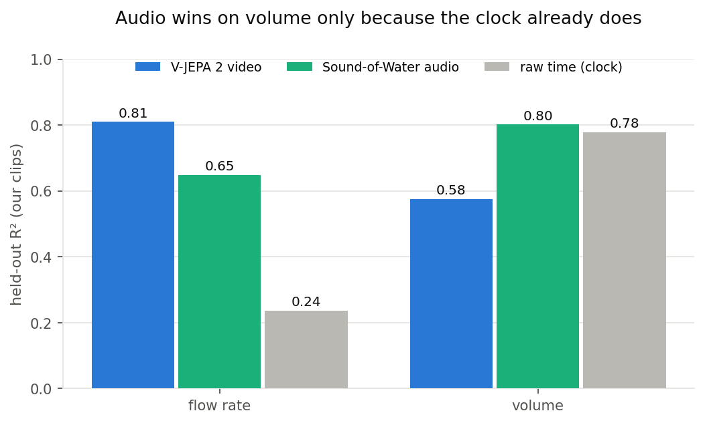
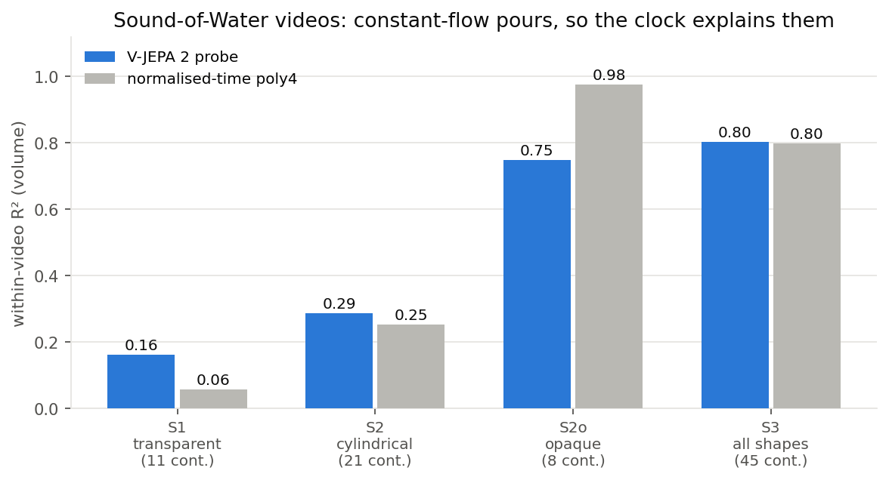
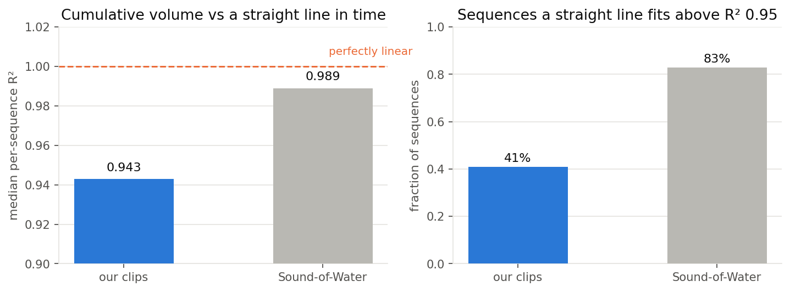
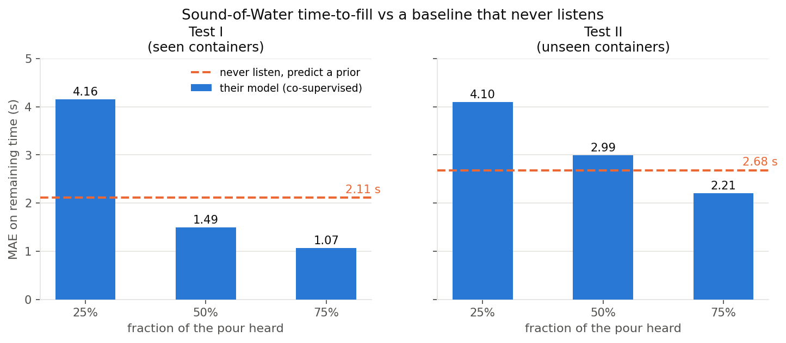

# 7. Cross-modal check: Sound of Water

- Their model infers pouring rate from the **pitch of the air column**, published as audio SOTA with no vision comparison
- Re-implemented as plain modules, loaded with `strict=True` as a correctness gate
- Sanity check on their own video: air column falls 86.1 to 9.1 cm, Spearman(t, λ) = **-0.995**

**Flow:** audio 0.65, above the temporal prior and the video CNN, **below V-JEPA 2** (0.81).

**Volume:** audio 0.80 looks strong until you notice the clock already gets 0.78. Not evidence of audio volume perception.

Caveat now closed. The old V-JEPA volume 0.67 was the attentive probe on **one split**, and that split was the lucky one. The matched **4-fold** attentive run gives **0.576 ± 0.087**, below both the audio 0.80 and the clock 0.78. So "audio beats video on volume" holds, and by more than we claimed.

---

# 8. Our probe on their dataset

- 780 videos, 45 containers, grouped CV by container
- Their target is **model-derived**, so this measures video-probe vs audio-physics agreement, not ground truth
- Their pours are constant rate by design, so volume within a video is nearly linear in time

**Why the clock cannot lose here:** constant rate + fill to completion means `T = V/Q`, so `V(t)/V = t/T` and **the rate cancels**. Normalised time *is* fill fraction. Randomising Q between videos cannot touch it.

**Result:** the probe beats the clock only on transparent containers (+0.105). It **loses on opaque ones** (-0.227), where the level is invisible but perfectly time-predictable.

Their own annotation is the tell: **988 of 1010 pours are labelled constant flow rate, exactly one is labelled non-constant.**

---

# How clock-explainable is each dataset, measured

- Straight line in time fitted to each sequence's cumulative volume
- **Theirs 0.989 median, 83% above 0.95.** Constant flow makes filling linear
- **Ours 0.943 median, 41% above 0.95.** Varying flow bends the curve

- **A difference of degree, not kind.** Volume is near-linear in *both*, which is why the clock is strong on ours too
- They separate on **flow**: on ours the clock scores 0.24 against a real measured derivative, theirs is a single scalar per video
- Their flow is a derivative of a model estimate, so probe and baseline both sit at ~0

---

# In fairness: the paper says it outright

### They designed against the clock

> "Across videos, we **randomly vary the flow rate** but keep it **approximately constant within a single video**."

> "For time to fill, we **assume a constant flow rate** (since otherwise, one could pause pouring midway leading to ill-defined time to fill)."

### Which resolves the whole question

- The randomisation is **between pours**, not within one. Verified in their data: same container, **2.3 to 4.3× spread** in fill time
- Constant-within-pour is not an oversight, it is **load-bearing**: their time-to-fill task is ill-defined without it
- So our clock baseline and their claim are about **different axes**, and both are correct

**Consequence for us:** their corpus cannot test a flow-rate probe, by construction. Their flow ground truth is a **single scalar per video** (container volume ÷ fill time), not a trace. That fully explains why our flow run on their data was degenerate.

---

# The same lesson, pointed at them

- Their metric is remaining time `τ = T − t`. A baseline that **never listens** predicts `τ̂ = T̄ − t`, using only the free audio length
- Container-mean prior on Test I, global mean on Test II. Its MAE is flat across cut levels by construction

- **At 25% heard, not listening beats the model** on both test sets. It is competitive at 50% on Test II
- Relative error stays at 31 to 83% of the target throughout
- Not a refutation: their model clearly wins once it has heard half the pour, which is the regime the affordance argument needs

---

# Where the pieces sit relative to each other

| arm | what it was for | verdict |
|---|---|---|
| **Own-lab clips, flow** | the deliverable | R² 0.81 ± 0.04, MAE ~7 g/s |
| Own-lab clips, volume | the harder target | 0.58, below the clock's 0.78 |
| Kinetics video CNNs | the fair baseline | 0.53, the +0.28 gap is the real claim |
| Sound of Water on our data | cross-modal reference | 0.65 flow, loses to vision |
| Our probe on Sound of Water | external validation | inconclusive, their target is clock-explainable |
| UWLPD | pipeline smoke test | mask-derived proxy only, no mL labels |
| SimLiquid | planned sim pretrain | renderer validated, 10k render not yet run |

