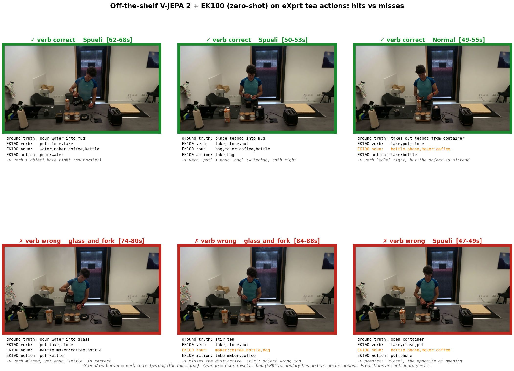

# V-JEPA 2 + EK100 for action labelling

EgoPER tea, egocentric, zero-shot (no fine-tuning)

- Frozen V-JEPA 2 features plus the EK100 action head, applied off the shelf
- Top-5 verb accuracy 0.96 over 220 ground-truth action segments
- Reads the right actions: pour, take, insert, stir
- Flags anomalies too: microwave (added step) and knife (wrong tool)
- Main limitation is the EPIC vocabulary (no tea, mug, teabag), not perception

---

# Transfer to eXprt (third-person view)

- eXprt is a fixed third-person wide shot, not egocentric
- Off-the-shelf EK100 head fails: top-1 verb 0.05, fixates on the background
- A probe on the frozen V-JEPA embeddings recovers the action signal
- Leave-one-video-out accuracy 0.74, permutation null 0.30, p < 0.003
- Finetuning approach: 19 hand-labelled segments, mostly pour vs put, more labels needed

---

# eXprt probe, qualitative examples

Border = verb correct (green) / wrong (red) · orange = noun misclassified (no tea nouns in EPIC) · only large, unambiguous cues survive the distant third-person view

