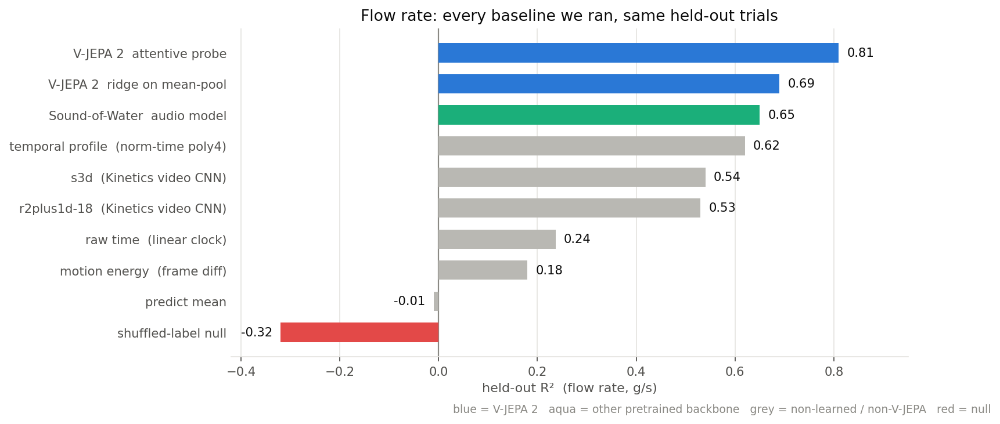
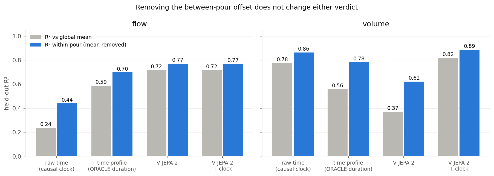
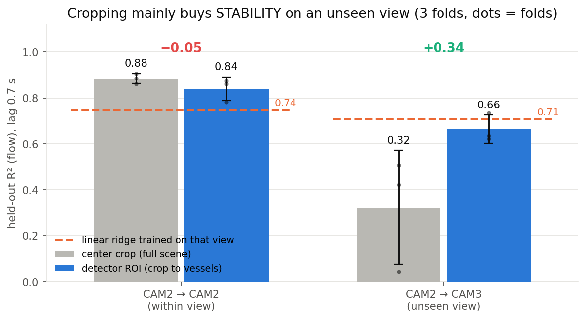

# Frozen V-JEPA 2 reads pouring flow rate

Everything since the pouring dataset, in four slides

121 clips &middot; 18 trials &middot; 12 container combos &middot; gram-level scale ground truth

---

# 1. The result

**R² 0.81 ± 0.04**, MAE 7 g/s. Four folds group by trial, so each fold holds out whole containers and scenes.

Encoder stays frozen. Only a light attentive head trains. The gap is the representation, not the head.

Beats the fair video CNN by **+0.28** and the audio model by **+0.16**. A per-frame image CNN scores 0.00.

---

# 2. Flow is a vision problem, volume is a clock

**Volume:** elapsed time alone gets 0.78. V-JEPA alone gets 0.37. Cumulative mass rises with the clock, so the clock wins.

**Vision still adds.** V-JEPA plus clock reaches 0.82, a **+0.19 skill** gain over the clock. Removing each pour's own mean changes neither verdict.

**Flow needs vision.** A straight line gets 0.24. Even a time profile handed the oracle duration gets 0.59. Integrating predicted flow gives total mass to **14 g median**.

---

# 3. What the ablations settled

Cropping trades accuracy for robustness. Its niche is a new angle with **no labels at all**. Given any labeled data there, a linear ridge on it already wins.

| question | verdict |
|---|---|
| Is the ground truth aligned? | **No.** 0.7 s water-transit lag, worth +0.09 |
| Does the pretrained head matter? | **No.** Three inits tie |
| One probe, both views? | **Yes.** It lifts the weak view |
| Transfer to an unseen view? | **No.** Cropping mostly fixes it |
| Does container size help volume? | **No**, even with a perfect oracle |
| Can a better loss fix the tails? | **No.** The residual is aleatoric |
| Does audio beat it? | **On volume only.** Flow stays ours |

---

# 4. Position, and the next number worth having

Sound of Water audio model, our clips, matched protocol

- Audio wins volume (0.80), loses flow (0.65). Our contribution sits on **flow**
- Their own dataset cannot test us. Constant rate plus fill to completion makes `t/T` **identical** to fill fraction. A clock scores up to 0.98 there
- **Open:** enter the Wilson et al. mass benchmark. Published protocol, existing baseline ladder, **no video-foundation-model entry**
- **More data** is the only lever left on absolute totals

Code: `pouring/pour_probe` &middot; runs: `mlflow.db`, experiments `pour_probe*`

